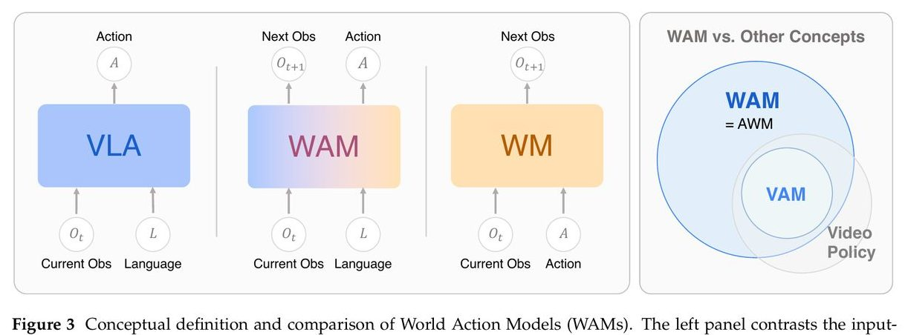
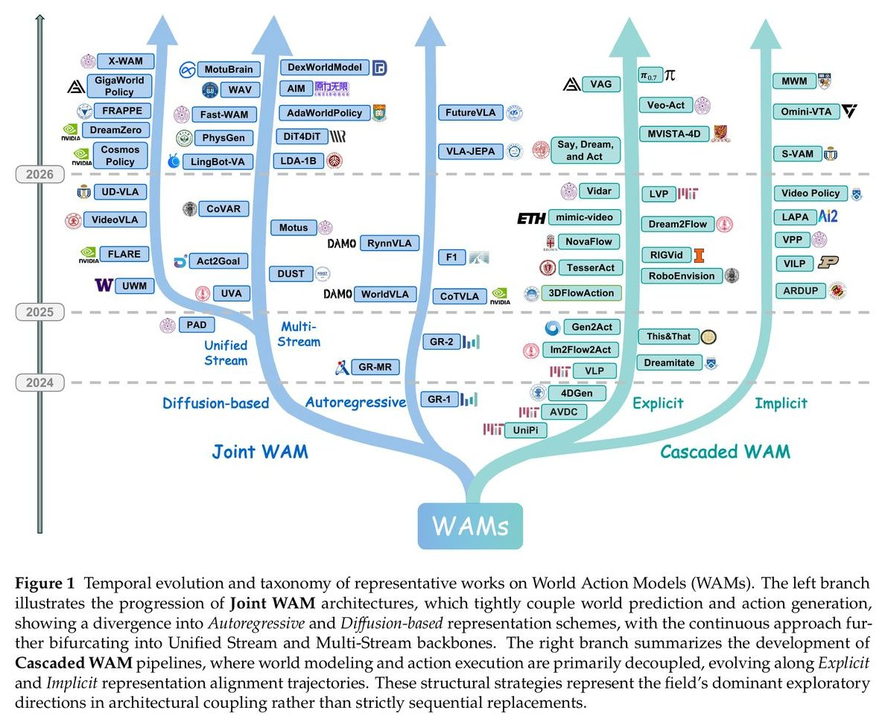
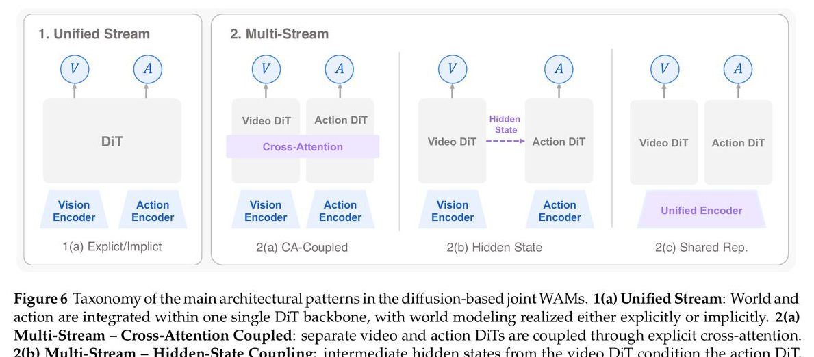

## 摘要

这篇综述首次系统地梳理了 **World Action Models（WAMs，世界动作模型）**这个新方向：如何把"预测世界变化"和"生成机器人动作"统一进一个模型。

当前主流的 VLA（Vision-Language-Action）模型只学"看到什么就做什么"的反射映射，不去想"做了这个动作后世界会怎样"。好比一个人闭着眼做饭：手在动，但不预判下一秒锅里发生什么。WAM 就是要补上这块：让模型既能预测未来状态，又能基于预测生成动作。

论文将现有方法整理成一棵分类树：**Cascaded WAM**（先预测、再出动作）和 **Joint WAM**（一个模型同时搞定），并从架构、数据、评估三个维度全面扫描。分类框架本身是论文最大的贡献，但论文也坦言：目前还没有公平的对比实验证明哪种架构更好。

## 一、Motivation

### 场景：机器人在厨房倒水

想象一个机器人在厨房里倒水。VLA 模型看到壶和杯子、收到"倒水"指令，直接输出关节角度。它不知道壶倾斜 30 度时水才开始流、不知道水到杯沿该停手、不知道壶拿歪了水会洒。它做的是**模式匹配**：训练时见过类似场景，就照搬动作。

常见任务上这能凑合，但换个场景就容易出错：杯子比训练时小一半？壶形状没见过？桌上多了个东西？VLA 内部没有"世界会怎么变"的模型，碰到偏差只能硬猜。

### 前人卡在哪

世界模型不是新东西。Dreamer 系列、PlaNet 在 RL 里早就能预测未来状态、在想象中做规划。问题是它们**和动作策略各自为政**：世界模型只管预测，不管动作；VLA 只管动作，不管预测。两条路的优势没有合流。

### WAM 的切入点

WAM 就是要把两条路焊在一起：一个模型**同时**建模"世界会怎么变"和"该怎么动"。形式上就是联合建模 $p(o', a | o, l)$，给定当前观测 $o$ 和语言指令 $l$，同时预测下一步世界状态 $o'$ 和动作 $a$。而不是像 VLA 只管 $p(a | o, l)$，也不像世界模型只管 $p(o' | o, a)$。

## 二、现存问题

- **VLA 缺少物理预见**：只做 observation→action 的反射映射，不预判动作后的环境变化，遇到陌生的物理场景（滑动、碰撞、流体）容易出错。
- **世界模型和策略脱节**：传统 RL 里世界模型是外部工具，不是策略本身的一部分，分开训练、分开部署，信息传递有损耗。
- **数据需求冲突**：VLA 需要配对的 (观测, 动作) 数据，这种数据贵且少；世界模型能用无标注视频，但学不到精确的因果关系。两者需求矛盾。
- **评估体系割裂**：世界模型用视频质量指标评估，策略用任务成功率评估，缺少统一协议来衡量"预测和行动是否真正协同"。
- **术语混乱**：Video Action Models、Action World Models、Video Policies 等名称所指有交叉但不同，文献间经常混用。

## 三、相关工作

### VLA 家族

从 RT-2 开始，VLA 把预训练 VLM 的语义理解灌到机器人策略里，用 next-token prediction 生成动作。OpenVLA、π₀ 是后续代表。优势是语言泛化强，能理解新指令；短板是只做反射映射，不建模物理。

### World Models 家族

从 PlaNet/Dreamer 到 V-JEPA，世界模型分两条路线：**像素级预测**（直接生成未来帧）和**隐式预测**（在 latent space 推演状态）。前者直观但慢，后者快但不可解释。都只管预测，不生成动作。

### Video Foundation Models

Sora、Wan、Veo 3 等视频生成大模型积累了丰富的"世界怎么动"的先验。WAM 很多方法直接拿它们做 backbone，用预训练视频能力提供世界建模基础，再接上动作生成。这是 WAM 快速发展的关键推力。

### 和 WAM 的关系

WAM 不替代以上任何一个，而是**把它们焊在一起**：继承 VLA 的语言理解、世界模型的物理预测、视频大模型的视觉先验，合成一个统一基础模型。

## 四、核心框架：WAM 的架构分类

这是论文最有价值的部分：按**世界预测和动作生成的耦合方式**，将所有 WAM 方法分成两大类、多个子类。

*Figure 3：VLA、WAM、WM 的输入输出对比。VLA 只输出动作；WM 只预测未来状态；WAM 两者兼顾。*

三个公式把区别说清楚了：

VLA 只管"给我看到的，输出要做的"：

$$\mathcal{L}_{\text{VLA}} = \mathbb{E}_{(o,l,a) \sim \mathcal{D}} \left[ -\log p(a \mid o, l) \right]$$

> 损失 = 给定当前观测和语言指令，预测正确动作的负对数似然。只关心动作对不对，不关心世界会怎样变化。

World Model 只管"给我看到的和要做的，预测世界会怎样"：

$$\mathcal{L}_{\text{WM}} = \mathbb{E}_{(o,a,o') \sim \mathcal{D}} \left[ -\log p(o' \mid o, a) \right]$$

> 损失 = 给定当前状态和动作，预测下一个状态的负对数似然。只关心预测准不准，不直接生成动作。

WAM 两手都抓：

$$\mathcal{L}_{\text{WAM}} = \mathbb{E}_{(o,l,o',a) \sim \mathcal{D}} \left[ -\log p(o', a \mid o, l) \right]$$

> 损失 = 联合预测下一个世界状态和动作的负对数似然。模型必须同时理解"世界怎么变"和"该怎么做"。

*Figure 1：WAM 的时间线与分类树。左侧是 Joint WAM（一体化），右侧是 Cascaded WAM（流水线）。*

### 4.1 Cascaded WAM：先预测，再行动

思路直接：先用世界模型生成未来场景，再用另一个模型从中提取动作。两步走，各司其职。

按中间表征分两种：

**显式规划（Pixel-space）**：世界模型直接生成未来 RGB 视频帧，然后用 Inverse Dynamics Model（IDM）或几何方法从视频里提取动作。代表工作是 **UniPi**，用 text-conditioned diffusion 模型生成任务执行视频，再用一个 CNN 逐帧回归动作。好处是直观，可以利用强大的视频生成预训练模型；坏处是生成视频很慢，而且"好看的视频"不一定能提取出"好用的动作"。后来的 AVDC、Im2Flow2Act 干脆跳过 RGB，用 optical flow 或 3D flow 做中间表征，绕过了"视频画质"和"动作可用性"之间的 gap。

**隐式规划（Latent-space）**：不生成显式的视频帧，直接在 latent space 里预测未来状态，再从 latent 特征里解码动作。代表工作是 **VPP**，用 VAE 编码观测帧、用 diffusion 在 latent space 做单步预测、用轻量 policy network 从 latent 条件生成动作，推理速度可以做到实时。好处是快，坏处是不可解释，你看不到模型在"想象"什么。

### 4.2 Joint WAM：一个模型搞定一切

Joint WAM 用统一模型**同时**预测未来状态和生成动作。世界建模不是外部模块，而是推理过程的内在部分。

*Figure 6：Diffusion-based Joint WAM 的四种架构模式。1(a) 统一 DiT 处理世界和动作；2(a-c) 多流设计通过不同耦合方式交换信息。*

#### 4.2.1 Autoregressive 路线

将世界状态和动作都 tokenize 成序列，用因果语言模型逐 token 生成。

- **Explicit Decoupled**（GR-1/GR-2）：保持视觉 token 和动作 token 各自的格式，用不同的 head 分别解码。GR-1 用 dual-branch heads 同时预测 future visual patches 和 continuous actions。
- **Unified Discrete**（CoT-VLA、WorldVLA）：把连续动作和图像全部量化成离散 token，塞进一个统一的 vocabulary，用同一个 next-token prediction head 来生成。挑战是连续物理量被离散化后误差会累积。CoT-VLA 用 bifurcated attention 来缓解这个问题。
- **Predictive Latent**（VLA-JEPA）：不生成显式的视觉 token，改为在 latent space 预测未来的 embedding。通过一个 frozen target network 编码未来帧作为监督信号，训练时学到的是 latent 转移动力学。

#### 4.2.2 Diffusion 路线

用 diffusion 或 flow matching 联合生成未来状态和动作，天然支持多步并行，不受自回归的顺序瓶颈约束。

- **Unified Stream**（PAD、UWM、DreamZero、Cosmos Policy）：一个 DiT 同时 denoise 视频 latent 和动作 chunk。UWM 最有意思的设计是给世界和动作**各自独立的 noise schedule**，推理时通过控制各自的噪声水平，同一个模型可以切换成"纯策略"、"纯世界模型"、"逆动力学模型"等不同模式。
- **Multi-Stream**：世界预测和动作生成分在不同的 DiT 分支里，通过某种耦合机制交换信息：

  - **Cross-Attention Coupled**（CoVAR、LDA-1B、Motus）：两个 DiT 通过 cross-attention 互看对方的特征。
  - **Hidden-State Coupled**（DiT4DiT、Fast-WAM）：视频分支的中间隐状态单向传给动作分支作为 conditioning。Fast-WAM 推理时甚至可以完全丢掉视频分支，只保留一个 forward pass 的 world feature 来条件化动作生成，做到了零额外开销。
  - **Shared Representation**（UVA、PhysGen）：先用一个共享 encoder 把世界和动作融合到统一 latent，再用各自的解码头分别输出。

*WAM 架构设计空间：两大类、六条技术路线*

## 五、数据生态与评估体系

### 5.1 四类训练数据

WAM 的数据需求独特：既要高质量 (观测, 动作, 下一步观测) 三元组学因果动力学，又要大量无标注视频学视觉先验。论文梳理了四类数据源的取舍：

关键发现：WAM 的独特优势在于**统一消化多种数据**，高质量三元组用于因果学习，无标注视频通过联合训练策略（如 UWM 的独立 noise schedule）也能消化吸收。传统 VLA 做不到这一点。

### 5.2 评估框架

评估分两个维度来看：

**世界建模能力**三层评估：

- **Visual Fidelity**（视觉保真度）：PSNR、SSIM、LPIPS、FVD 等。看生成的视频够不够清晰、连贯。
- **Physical Commonsense**（物理常识）：VideoPhy、PhyGenBench、Physics-IQ 等。看物体有没有穿透、重力有没有违反、因果有没有对。
- **Action Plausibility**（动作可用性）：WorldSimBench、"Wow, wo, val!"（论文名）等。看从生成的视频里能不能提取出**真正能用的动作**。这是最关键也最被忽略的一层，很多视觉上很好看的视频，提取出的动作却根本不能执行。

**动作策略能力**通过 40+ 个 benchmark 评估，覆盖桌面操作（LIBERO、RLBench）、双臂/人形（RoboTwin、BiGym）、移动操作（BEHAVIOR-1K）、柔性物体（SoftGym、TacSL）、真机评估（RoboArena、Maniparena）等。

论文指出核心缺陷：**没有评估协议能同时衡量世界预测和动作执行的因果关系**。两者分开评，可能出现"视频好看但动作没法用"的情况。

## 六、总结

核心贡献有三：（1）正式定义 WAM，与 VLA、World Model、Video Policy 划清边界；（2）建立清晰的分类树（Cascaded vs Joint、Autoregressive vs Diffusion、Unified vs Multi-Stream）；（3）从数据和评估两个维度做系统扫描。

WAM 作为 VLA 的下一代范式被正式提出，从"看了就做"升级为"想了再做"。不过论文也留下几个硬问题：缺乏公平对比来判定 Joint 和 Cascaded 孰优；推理延迟远不及 50Hz 实时要求；多模态物理状态（触觉、力）预测几乎是空白。

## 七、Insight

这篇综述是分类学工作，思想火花不在新方法，在于这张地图让你看到一件事：**"想象未来"的价值，可能不在于生成出来的视频，而在于生成过程中被迫习得的物理因果结构。**

证据支撑这个判断：Fast-WAM 推理时丢掉视频分支只保留 world features，性能不降；FLARE 的 future tokens 学到了未来表征却从不输出视频；多个工作发现去掉 video co-training 后动作质量下降。换句话说，世界建模的训练梯度比推理输出更值钱：你需要"学过想象"，但不必"每次都想象"。

## 八、Q&A

**Q1：WAM 和普通 VLA 的本质区别是什么？不就是加了个 video prediction 的辅助 loss 吗？**

不只是。一个模型加了 video prediction 辅助 loss 但推理时只输出 action，严格来说还是 VLA（比如 FLARE 处于边界上）。WAM 的定义要求模型必须满足两个条件：(1) 有 forward predictive modeling，即生成未来状态的可量化表征（不管是 pixel 还是 latent）；(2) 动作生成必须和这个预测**耦合**，动作不是独立输出的，而是基于或对齐于预测的未来。所以本质区别不在 loss 形式，而在于世界预测是否参与了动作的推理过程。

**Q2：Cascaded WAM 和 Joint WAM，到底哪个更好？**

论文明确说了：**不知道**。目前没有一个公平的 apple-to-apple 实验在相同数据、相同规模、相同评测协议下比较两者。理论上 Cascaded 有更好的可解释性（你能看到中间生成的视频来 debug），Joint 有更紧的信息流（不会在中间传递时丢信息）。但"更紧的信息流"是否真的转化为"更好的动作"，还没有实验证据。这是论文指出的最大 open question 之一。

**Q3：UWM 的"独立 noise schedule"为什么是个聪明的设计？**

UWM 给世界预测和动作生成各自一个独立可控的噪声水平。推理时你可以：把动作侧设为全噪声 → 纯世界模型模式；把世界侧设为全噪声 → 纯策略模式；两边都正常 → WAM 模式；把世界侧设为零噪声、动作侧正常 → 逆动力学模型模式。一个 checkpoint 四种用法，不需要改任何架构。这个设计还优雅地解决了数据问题：对于没有动作标注的视频，把 action 侧设为全噪声就行了，denoising objective 自动退化成纯 video prediction loss。

**Q4：为什么"好看的生成视频"不一定能提取出"好用的动作"？**

这是 Cascaded WAM 的一个核心难题。视频生成模型优化的是视觉保真度（FVD、LPIPS 等），这些指标关心的是"像不像"。但 IDM 从视频提取动作需要的是"精确的 end-effector 位移信息"，差 1 个像素可能意味着抓取偏了 1 厘米。一段视觉上很流畅自然的视频，可能在子像素级的精度上完全不满足动作提取的需求。"Wow, wo, val!"（论文名） 这篇工作就实验证明了：多数 SOTA 视频生成模型在 IDM Turing Test 上接近零成功率。

**Q5：WAM 目前能做到实时控制吗？**

很勉强。论文提到 DreamZero 通过一系列系统级优化（异步执行、DiT caching、量化、CUDA graph compilation）把 joint diffusion WAM 的推理速度推到了约 7Hz。这对一些不需要超高频控制的任务勉强够用，但离 non-generative VLA 政策的 50Hz 标准差了一个数量级。Cascaded WAM 更慢，需要先走完整个 video generation 再走 IDM。论文也提出了一个更深的问题：也许应该追求的不是"让预测更快"，而是"找到每个任务真正需要的最小预测精度"，即 task-adaptive predictive fidelity。

**Q6：这篇综述覆盖了多少工作？有没有明显的遗漏？**

论文引用了 366 篇文献，覆盖了从 2018 年到 2026 年 5 月的工作。覆盖面非常广，但有一个明显的倾角：主要聚焦于 manipulation（桌面操作和双臂），locomotion（移动控制）方向的 WAM 讨论较少，尽管 humanoid locomotion 也有世界建模的需求。另外，论文对各方法的实验数字几乎没有横向对比（没有统一的 benchmark 表格），更多是"方法描述 + 定性分析"，这和"没有公平对比实验"的开放问题是一致的。

**Q7：如果要从零开始做一个 WAM，选什么 backbone 和架构最合理？**

从论文的 Table 3 可以看到趋势：(1) backbone 上，Wan 2.x 系列和 Cosmos-Predict2 是最常被选用的视频生成 backbone，因为它们有强大的预训练视觉先验；(2) 架构上，Multi-Stream Cross-Attention Coupled（如 LDA-1B 那种）是目前最灵活的选择，可以独立控制世界和动作分支的规模、冻结策略、数据混合比例。(3) 参数规模从 0.5B 到 14B 不等，但 2-5B 是甜点区。(4) 如果算力有限且追求实时性，考虑 Fast-WAM 那种"训练时有世界建模、推理时只用 world features"的设计，几乎是免费午餐。